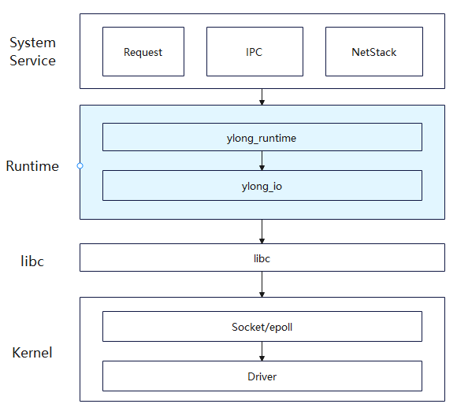

# ylong_runtime

## 简介
Rust异步运行时库，用于生成并执行异步任务。同时提供了异步网络 IO，异步文件 IO，定时器，异步同步原语，并行迭代器等功能。

### 图1 整体架构图


- `System Service`：使用 Rust 异步能力的系统服务，包括上传下载、IPC、网络协议栈等；
- `Runtime`：Rust 异步运行时，为依赖它的系统服务提供 Rust 异步编程界面和任务调度能力，从功能层次上可以分为 `ylong_runtime` 和 `ylong_io` 两层：
  - `ylong_runtime`：异步运行时的功能主体，提供了大量 Rust 标准库接口的异步化接口，同时提供了对用户任务的生命周期管理和调度等能力；
  - `ylong_io`：依赖 `libc` 库，结合系统的 epoll 机制，实现了非阻塞 TCP 和 UDP 功能，作为 `ylong_runtime` 异步 IO 的底座；
- `libc`：Rust 三方库，提供对系统 libc 接口的 Rust 封装；
- `Kernel`：操作系统内核提供的能力，如 socket，epoll 等。

### 图2 仓中不同 crates 间的关系


`ylong_runtime`为功能主体，用户使用时直接依赖该库即可。`ylong_runtime` 依赖以下三个 crates：

- `ylong_io`：提供了事件驱动型网络 IO，通过 epoll 实现了非阻塞性的 TCP 和 UDP。用户无需直接依赖该库。
- `ylong_ffrt`：提供了 Function Flow Runtime 接口的 Rust 封装，可作为 `ylong_runtime` 的底层任务调度器。可通过 `ylong_runtime` 的 feature `ffrt` 来配置是否使用该调度器，OpenHarmony 上默认使用该调度器。用户无需直接依赖该库。
- `ylong_macros`：实现 `ylong_runtime` 所需的过程宏，目前主要用于提供 `select!` 过程宏。可通过 `ylong_runtime` 的 feature `macros` 来配置是否使用该库，OpenHarmony上默认使用该库。用户无需直接依赖该库。

### 图3 ylong_runtime 内部架构图


`ylong_runtime` 对外 API 分为四个模块:

- `Sync`：异步同步原语，即可在异步上下文中使用的同步原语，包括异步的互斥锁、读写锁、信号量、通道等；
- `Async IO`：异步网络 IO & 文件 IO，提供可在异步上下文中使用的 IO 接口，包括 TCP、UDP、文件的创建、关闭、读、写等；
- `Parallel Calculation`：并行计算功能，支持将用户数据自动拆分为多个小任务并行处理，用户可以在异步上下文对任务的处理结果进行异步等待；
- `Timer`：异步定时器，提供定时功能，包括异步的睡眠、间隔超时等；

上述异步接口的特点是在异步上下文中进行等待不会阻塞当前线程，运行时会自动将线程切换到下一个可执行的任务去执行，从而避免线程资源的浪费，提高系统整体的并发能力。

异步接口的这种能力是通过 `Reactor` 和 `Executor` 这两个模块实现的：

- `Reactor`：进行 IO 系统事件以及 Timer 事件的监听，并通过监听到的事件唤醒阻塞的任务，将任务加入 `Executor` 的任务队列：
  - `IO Driver`：IO 事件轮询器，定期查看是否有 IO 事件到来；
  - `Timer Driver`：Timer 事件轮询器，定期查看是否有 Timer 将要超时；
- `Executor`：进行任务调度以及任务执行的主体。用户提交的任务进入 `Executor` 的任务队列，并在合适的时机得到执行。执行过程中如遇到任务阻塞，则 `Executor` 按一定的策略选择下一个可执行的任务去执行。 `ylong_runtime` 拥有两个可互相替换的调度器：
  - `ylong executor`：Rust 实现的任务调度器。
  - `FFRT executor`：Function Flow Runtime 任务调度器，C++ 实现。OpenHarmony 上默认使用该实现。

## 目录
```
ylong_runtime
|── docs                            # 使用文档
|── figures                         # 架构图
|── patches                         # 门禁编译需要的补丁
|── ylong_ffrt
|    └── src                        # FFRT ffi封装
|── ylong_io
|    |── exmaples                   # ylong_io 代码示例
|    |── src                        # ylong_io 源码
|    |    └── sys                   # 操作系统相关io实现
|    |         |── linux            # Linux 事件驱动IO实现
|    |         └── windows          # Windows 事件驱动IO实现
|── ylong_runtime                   
|    |── benches                    # ylong_runtime 性能用例
|    |── examples                   # ylong_runtime 代码示例
|    |── src                        # ylong_runtime 源码
|    |    |── builder               # Runtime builder实现
|    |    |── executor              # Runtime executor实现
|    |    |── ffrt                  # FFRT 适配
|    |    |── fs                    # 异步文件IO实现
|    |    |── io                    # 异步IO接口以及对外API
|    |    |   └── buffered          # 异步缓存读写实现
|    |    |── iter                  # 异步并行迭代器实现
|    |    |   |── parallel          # 数据容器适配
|    |    |   └── pariter           # 并行迭代核心业务实现
|    |    |── net                   # 异步网络IO/Driver实现
|    |    |   └── sys               # 系统IO异步实现
|    |    |       └── tcp           # 异步TCP实现
|    |    |── sync                  # 异步同步原语
|    |    |   └── mpsc              # 单生产者多消费者通道实现
|    |    |── task                  # 异步任务实现
|    |    |── time                  # 定时器实现
|    |    └── util                  # 公共组件
|    |        |── core_affinity     # 绑核实现
|    |        └── num_cpus          # 获取核数实现
|    └── tests                      # ylong_runtime 测试用例
└── ylong_runtime_macros
     |── examples                   # ylong_runtime_macros 代码示例
     └── src                        # ylong_runtime 过程宏实现
```

## 编译构建

### 使用Cargo编译
1. 在 `Cargo.toml` 中引入 `ylong_runtime`
```toml
[dependencies]
ylong_runtime = { git = "https://gitee.com/openharmony-sig/commonlibrary_rust_ylong_runtime.git", features = ["full"]}
```

### 使用gn编译
1. 在`bundle.json`中添加`ylong_runtime_mod`
```
  "deps": {
    "components": ["ylong_runtime_mod"]
  }
```
2. 在`BUILD.gn`中添加`ylong_runtime_mod:lib`
```
external_deps += ["ylong_runtime_mod:lib"]
```
3. 目前通过gn编译使用ylong_runtime时需要加上inner
```
use ylong_runtime_inner
```

## 用户指南

详细内容请见[用户指南](./docs/user_guide.md)

## 致谢

基于用户的使用习惯，本库的 API 在将原本 Rust 标准库同步的接口实现改为异步后，保留了标准库原本的命名风格，如 ``TcpStream::connect``、``File::read``、``File::write`` 等。同时也参考了 Tokio 的部分通用 API 设计思想，在此对 Rust 标准库和 Tokio 表示感谢。

